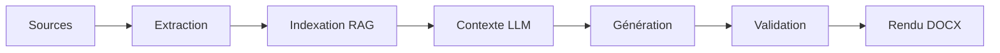

# 🎨 Guide Génération - Pipeline RAG & LLM

**Version** : 4.1  
**Dernière mise à jour** : 28 décembre 2025

Ce guide explique le fonctionnement de la pipeline de génération de bilans professionnels, de l'extraction des sources à la production du document final.

---

## 🎯 Vue d'Ensemble

### Pipeline Complète



**Durée moyenne** : 2-5 min/bilan (selon sources)

---

## 📂 1. Extraction Multi-Format

### Formats Supportés

| Format | Extension | Extracteur | Fiabilité |
|--------|-----------|------------|-----------|
| PDF | `.pdf` | PyMuPDF (fitz) | ✅ Excellente |
| Word | `.docx` | python-docx | ✅ Excellente |
| Texte | `.txt` | natif | ✅ Parfaite |
| Word Legacy | `.doc` | LibreOffice (soffice) | 🔵 Bonne |
| Outlook Email | `.msg` | extract-msg | 🔵 Bonne |

### Module : core/extract.py

#### Fonction principale : extract_sources()

```python
def extract_sources(
    source_files: list[Path],
    output_dir: Path,
    enable_doc_conversion: bool = True,
    enable_msg: bool = True
) -> tuple[list[Path], dict]:
    """
    Extrait le texte de multiples sources.
    
    Returns:
        (txt_files, metadata)
        - txt_files: Liste fichiers .txt générés
        - metadata: Infos extraction (formats, erreurs, warnings)
    """
```

**Workflow** :
1. Scan fichiers source (PDF/DOCX/TXT/DOC/MSG)
2. Extraction parallèle (jusqu'à 4 workers)
3. Conversion formats legacy (.doc → .docx → .txt)
4. Gestion erreurs gracieuse (jamais de crash)
5. Métadonnées extraction (durée, taille, succès)

#### Extraction PDF

```python
def extract_pdf(pdf_path: Path, output_dir: Path) -> Path:
    """Extrait texte PDF via PyMuPDF."""
    doc = fitz.open(pdf_path)
    text = "\n\n".join(page.get_text() for page in doc)
    # Sauvegarde .txt
    return txt_path
```

**Features** :
- Gestion multi-pages
- Détection encodage automatique
- Préservation mise en page (sauts lignes/paragraphes)

#### Extraction DOCX

```python
def extract_docx(docx_path: Path, output_dir: Path) -> Path:
    """Extrait texte DOCX via python-docx."""
    doc = Document(docx_path)
    text = "\n".join(p.text for p in doc.paragraphs)
    return txt_path
```

**Features** :
- Extraction paragraphes
- Gestion tableaux (optionnel)
- Headers/footers préservés

#### Extraction MSG (Emails Outlook)

```python
def extract_msg(msg_path: Path, output_dir: Path) -> tuple[Path, list[Path]]:
    """
    Extrait email .msg avec pièces jointes.
    
    Returns:
        (email_txt, attachment_paths)
    """
```

**Format email extrait** :
```
[EMAIL_MSG]
Subject: Candidature - Poste Développeur
From: candidat@example.com
To: rh@entreprise.ch
Date: 2025-12-28

Bonjour,

Veuillez trouver ci-joint mon CV...

[ATTACHMENTS: 2 files]
- CV_Candidat.pdf
- Lettre_Motivation.docx
```

**Gestion pièces jointes** :
- Extraction automatique : PDF, DOCX, DOC, TXT
- Sauvegarde dans sous-dossier `msg_attachments/`
- Indexation automatique dans RAG
- Limite : 4 types autorisés (sécurité)

**Fallback gracieux** :
```python
# Si extract-msg absent
if not MSG_SUPPORT_AVAILABLE:
    warnings.append("MSG_EXTRACTOR_MISSING")
    # Continue sans crash
```

#### Extraction DOC (Legacy)

```python
def extract_doc_via_libreoffice(doc_path: Path, output_dir: Path) -> Path:
    """Convertit .doc via LibreOffice puis extrait."""
    # 1. DOC → DOCX
    subprocess.run([
        "soffice", "--headless", "--convert-to", "docx",
        str(doc_path), "--outdir", str(output_dir)
    ])
    # 2. DOCX → TXT (via extract_docx)
    return extract_docx(docx_path, output_dir)
```

**Prérequis** : LibreOffice installé (`soffice` dans PATH)

---

## 🔍 2. Indexation RAG

### Module : core/context.py

#### LlamaIndex Integration

```python
from llama_index.core import VectorStoreIndex, Document

def build_rag_index(txt_files: list[Path]) -> VectorStoreIndex:
    """Construit index vectoriel pour RAG."""
    documents = [
        Document(text=file.read_text(), metadata={"source": file.name})
        for file in txt_files
    ]
    return VectorStoreIndex.from_documents(documents)
```

**Embeddings** :
- Modèle : `text-embedding-ada-002` (OpenAI) ou local
- Dimension : 1536
- Stockage : FAISS (en mémoire)

#### Query Engine

```python
query_engine = index.as_query_engine(
    similarity_top_k=5,  # Top 5 chunks pertinents
    response_mode="compact"  # Agrégation smart
)
```

**Paramètres clés** :
- **similarity_top_k** : Nombre chunks RAG (3-10)
- **response_mode** : `compact` (concis) / `tree_summarize` (détaillé)
- **streaming** : `False` (génération complète)

---

## 🤖 3. Génération LLM

### Module : core/generate.py

#### Fonction principale : generate_bilan()

```python
def generate_bilan(
    client_name: str,
    source_files: list[Path],
    template_path: Path,
    training_state: dict | None = None
) -> dict[str, str]:
    """
    Génère tous les champs du bilan.
    
    Returns:
        {"nom": "...", "prenom": "...", "experiences": "...", ...}
    """
```

**Workflow** :
1. Extraction sources → textes .txt
2. Construction index RAG
3. Chargement training_state.json (patterns)
4. Génération champs critiques en priorité
5. Génération champs secondaires
6. Validation format/cohérence
7. Export dict final

#### Prompt Engineering

**Structure prompt** :
```
Tu es un expert RH suisse spécialisé dans la rédaction de bilans professionnels.

## Contexte RAG
{contexte_extrait_sources}

## Patterns appris (Training State)
- Expériences professionnelles : en moyenne 25 lignes, max 45 lignes (p90)
- Formations : en moyenne 18 lignes, max 30 lignes (p90)

## Champ à générer
{nom_champ}

## Instructions
- Format : {format_attendu}
- Longueur max : {field_max_lines} lignes
- Style : Professionnel, neutre, suisse

## Contraintes
- Ne jamais inventer d'informations
- Citer sources si possible
- Respecter orthographe noms/dates
```

**Optimisations** :
- Contexte RAG : Top 5 chunks pertinents uniquement
- Training patterns : field_max_lines, section_stats
- Format validation : regex, bounds checks

#### Champs Critiques

**Priorisés** (générés en premier) :
1. **AVS** : `\b756[.\s]?\d{4}[.\s]?\d{4}[.\s]?\d{2}\b`
2. **Date naissance** : Format `JJ.MM.AAAA`
3. **Nom, Prénom**
4. **État civil** : Marié/Célibataire/Divorcé/etc.
5. **Nationalité** : Pays ou Suisse + canton

**Validation** :
```python
def validate_avs(avs: str) -> bool:
    """Valide format AVS suisse 13 chiffres."""
    clean = re.sub(r'[.\s]', '', avs)
    return bool(re.match(r'^756\d{10}$', clean))
```

#### Génération Streaming

```python
async def generate_field_streaming(
    field_name: str,
    context: str,
    max_lines: int
) -> AsyncGenerator[str, None]:
    """Génère champ en streaming (tokens progressifs)."""
    async for token in llm.stream_complete(prompt):
        yield token
```

**Usage Streamlit** :
```python
placeholder = st.empty()
async for token in generate_field_streaming("experiences", ctx, 50):
    placeholder.write(token)
```

---

## ✅ 4. Validation

### Module : core/validation.py

#### Règles Validation

**Champs obligatoires** :
```python
REQUIRED_FIELDS = [
    "nom", "prenom", "date_naissance",
    "adresse", "telephone", "email",
    "experiences_professionnelles"
]
```

**Formats** :
```python
FIELD_FORMATS = {
    "email": r'^[a-zA-Z0-9._%+-]+@[a-zA-Z0-9.-]+\.[a-zA-Z]{2,}$',
    "telephone": r'^(\+41|0)\s?\d{2}\s?\d{3}\s?\d{2}\s?\d{2}$',
    "date_naissance": r'^\d{2}\.\d{2}\.\d{4}$',
    "avs": r'^756[.\s]?\d{4}[.\s]?\d{4}[.\s]?\d{2}$'
}
```

**Longueur** :
```python
def validate_field_length(field_name: str, value: str, training_state: dict) -> bool:
    """Valide longueur vs field_max_lines."""
    max_lines = training_state["patterns"]["field_max_lines"].get(field_name, 100)
    actual_lines = len(value.split('\n'))
    return actual_lines <= max_lines
```

#### Production Gate

**Module** : `src/rhpro/production_gate.py`

**Scoring** :
```python
class ProductionGate:
    def evaluate(self, bilan: dict) -> Score:
        """
        Évalue qualité bilan (0-100).
        
        Critères:
        - Sources count : 20 pts
        - AVS détecté : 20 pts
        - Champs critiques : 30 pts
        - Warnings : -10 pts
        """
```

**Seuils recommandés** :
- **GO** : score ≥ 70
- **WARNING** : 50 ≤ score < 70
- **NO-GO** : score < 50

---

## 📄 5. Rendu DOCX

### Module : core/render.py

#### Fonction : render_to_docx()

```python
def render_to_docx(
    fields: dict[str, str],
    template_path: Path,
    output_path: Path,
    branding: dict | None = None
) -> Path:
    """
    Remplit template DOCX avec champs générés.
    
    Args:
        fields: Dict {nom_champ: valeur}
        template_path: Template .docx avec placeholders
        branding: Logo, couleurs client
        
    Returns:
        Chemin document final
    """
```

**Placeholders** :
```docx
{{nom}}
{{prenom}}
{{date_naissance}}
{{adresse}}
{{experiences_professionnelles}}
...
```

**Workflow** :
1. Chargement template via python-docx
2. Remplacement placeholders (regex + replace)
3. Application branding (logo, couleurs)
4. Export PDF optionnel (via LibreOffice)

#### Branding

**Structure** :
```python
branding = {
    "logo_path": "CLIENTS/Entreprise/logo.png",
    "primary_color": "#003366",  # Bleu foncé
    "font_family": "Arial"
}
```

**Application** :
```python
# Remplacement logo
logo_placeholder = doc.inline_shapes[0]
logo_placeholder.replace_with_image(branding["logo_path"])

# Couleurs titres
for paragraph in doc.paragraphs:
    if paragraph.style.name == "Heading 1":
        paragraph.runs[0].font.color.rgb = RGBColor.from_string(
            branding["primary_color"]
        )
```

---

## 🎛️ Configuration Avancée

### Paramètres LLM

**Fichier** : `core/config.py`

```python
LLM_CONFIG = {
    "model": "gpt-4",  # ou "gpt-3.5-turbo"
    "temperature": 0.3,  # Créativité (0 = déterministe)
    "max_tokens": 2000,  # Tokens max/réponse
    "top_p": 0.9,  # Nucleus sampling
    "frequency_penalty": 0.0,
    "presence_penalty": 0.0
}
```

**Recommandations** :
- **Production** : `temperature=0.1-0.3` (consistant)
- **Créatif** : `temperature=0.7-0.9` (varié)
- **Max tokens** : 2000-4000 (selon champs)

### Paramètres RAG

```python
RAG_CONFIG = {
    "chunk_size": 1024,  # Taille chunks embeddings
    "chunk_overlap": 200,  # Overlap entre chunks
    "similarity_top_k": 5,  # Chunks retournés
    "embedding_model": "text-embedding-ada-002"
}
```

**Chunk size** :
- Petit (512) : Précis mais contexte limité
- Moyen (1024) : ✅ Équilibré (recommandé)
- Grand (2048) : Contexte large, moins précis

---

## ⚙️ Optimisations Performance

### 1. Cache Extraction

```python
# Cache en mémoire (session Streamlit)
@st.cache_data
def extract_sources_cached(files: list[Path]) -> list[Path]:
    return extract_sources(files, output_dir)
```

**Gain** : ~80% si sources identiques

### 2. Parallélisation

```python
from concurrent.futures import ThreadPoolExecutor

with ThreadPoolExecutor(max_workers=4) as executor:
    txt_files = list(executor.map(extract_pdf, pdf_files))
```

**Gain** : ~3x sur corpus large

### 3. Streaming LLM

```python
# Génération progressive (UX)
async for token in llm.astream_complete(prompt):
    yield token  # Affichage temps réel
```

**Gain UX** : Perception temps réduit

---

## 🐛 Troubleshooting

### Erreur : Extraction PDF Vide

**Symptôme** : PDF extrait = 0 caractères

**Causes** :
1. PDF scanné (images) → OCR requis
2. PDF protégé → Impossible extraire
3. Encodage corrompu

**Solution** :
```python
# Activer OCR (optionnel)
text = extract_pdf_with_ocr(pdf_path)  # Tesseract
```

### Erreur : LLM Timeout

**Symptôme** : Génération bloquée après 60s

**Solution** :
```python
# Augmenter timeout
llm = OpenAI(timeout=180)  # 3 min
```

### Erreur : Placeholders Non Remplacés

**Symptôme** : `{{nom}}` toujours visible dans DOCX final

**Cause** : Placeholder mal formaté ou champ manquant

**Solution** :
```python
# Validation avant render
missing = [f for f in REQUIRED_FIELDS if f not in fields]
if missing:
    raise ValueError(f"Champs manquants : {missing}")
```

---

## 📊 Métriques Qualité

### Bilan Excellent

✅ **Score Production Gate** : ≥ 80/100  
✅ **Champs critiques** : 100% présents  
✅ **AVS** : Détecté + validé  
✅ **Longueur** : field_max_lines respectés  
✅ **Warnings** : 0  
✅ **Durée génération** : < 3 min

### Bilan Acceptable

🔵 **Score** : 60-79/100  
🔵 **Champs critiques** : ≥ 80%  
🔵 **AVS** : Détecté non validé  
🔵 **Warnings** : 1-3  
🔵 **Durée** : 3-5 min

### Bilan Insuffisant

❌ **Score** : < 60/100  
❌ **Champs critiques** : < 80%  
❌ **AVS** : Absent  
❌ **Warnings** : > 3  
❌ **Durée** : > 5 min

---

## 🔗 Intégration Complète

### Exemple : Pipeline End-to-End

```python
# 1. Extraction
txt_files, meta = extract_sources(
    source_files=[Path("CV.pdf"), Path("Email.msg")],
    output_dir=Path("output/extracted"),
    enable_msg=True
)

# 2. Chargement training state
training_state = json.loads(Path("training_state.json").read_text())

# 3. Génération
fields = generate_bilan(
    client_name="Jean Dupont",
    source_files=txt_files,
    template_path=Path("template.docx"),
    training_state=training_state
)

# 4. Validation
gate = ProductionGate(profile="normal")
score = gate.evaluate(fields)

if score.go_decision == "GO":
    # 5. Rendu final
    output = render_to_docx(
        fields=fields,
        template_path=Path("template.docx"),
        output_path=Path("output/bilan_final.docx")
    )
    print(f"✅ Bilan généré : {output}")
else:
    print(f"❌ Score insuffisant : {score.total}/100")
```

---

## 📚 Ressources

### Fichiers Clés

- **Extraction** : `core/extract.py`, `core/extractors/msg_extractor.py`
- **RAG** : `core/context.py`
- **Génération** : `core/generate.py`
- **Validation** : `core/validation.py`, `src/rhpro/production_gate.py`
- **Rendu** : `core/render.py`, `core/docx_branding.py`

### Commandes Utiles

```bash
# Test extraction
python demo_extraction.py --sources CV.pdf Email.msg

# Test génération
python demo_generation.py --client "Jean Dupont"

# Validation complète
python validate_acceptance.py

# Production gate
python demo_production_gate.py --profile normal
```

### Documentation Connexe

- [GUIDE_TRAINING.md](GUIDE_TRAINING.md) - Training dataset
- [API_REFERENCE.md](API_REFERENCE.md) - API complète
- [HISTORIQUE_IMPLEMENTATION.md](HISTORIQUE_IMPLEMENTATION.md) - Évolution

---

**Maintenu par** : Équipe SCRIPT.IA  
**Dernière revue** : 28 décembre 2025
