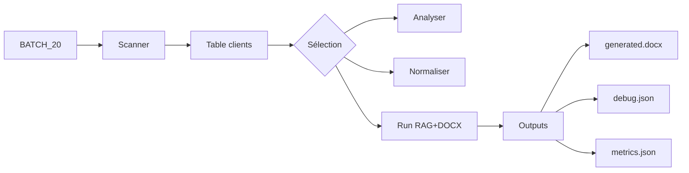

# QUICKSTART - UI Training RH-Pro

## Installation

```bash
# 1. Installer les dépendances
pip install -r requirements.txt

# 2. Configuration OpenAI (pour RAG)
export OPENAI_API_KEY="sk-..."
```

## Utilisation rapide

### Via Streamlit (recommandé)

```bash
streamlit run streamlit_app.py
```

Puis :
1. Naviguer vers **🎓 Entraînement Pipeline RH-Pro**
2. Sélectionner **📦 Batch (plusieurs clients)**
3. Browse → Sélectionner votre BATCH_XX
4. Cliquer **🔍 Scanner le batch**
5. Sélectionner les clients dans la table
6. Cliquer **🚀 Run (RAG+DOCX)**

### Via démo CLI

```bash
python demo_training_ui.py
```

Menu :
- `1` : Scanner un batch
- `2` : Analyser un client
- `3` : Générer un compte-rendu
- `4` : Quitter

## Structure attendue

```
data/samples/BATCH_20/
├── KARAOUI Malik/
│   ├── 01 Dossier personnel/
│   │   ├── fiche_inscription.docx
│   │   └── ...
│   ├── 03 Tests et bilans/
│   │   ├── test_psychotechnique.pdf
│   │   └── ...
│   ├── 06 Rapport final/
│   │   └── rapport_bilan_2024.docx  ← GOLD
│   └── ...
├── ARIFI Said/
│   └── ...
└── ...
```

## Workflow complet



## Outputs générés

Après **Run (RAG+DOCX)** :

```
output/
├── client_01_generated.docx   ← Compte-rendu rempli
├── client_01_debug.json       ← Preuves + citations
├── client_01_metrics.json     ← Métriques de qualité
└── client_01_gold_reference.docx  ← GOLD copié
```

## Exemple de métriques

```json
{
  "required_coverage": 85.0,
  "weighted_coverage": 72.3,
  "quality_score": 0.78,
  "avg_confidence": 0.81,
  "total_fields": 20,
  "filled_fields": 16
}
```

**Interprétation** :
- ✅ Couverture requise (85%) : champs obligatoires remplis
- ⚠️ Couverture globale (72%) : peut être améliorée
- ✅ Score qualité (0.78) : bon
- ✅ Confiance (0.81) : bonne

## Garde-fous

Mode strict activé par défaut :
- ❌ **Pas d'invention** : Si info non trouvée → "Non renseigné"
- ✅ **Citations obligatoires** : Chaque champ cite sa source
- ✅ **Détection hallucinations** : Patterns surveillés
- ✅ **Traçabilité** : debug.json contient les preuves

## Troubleshooting

### Erreur : "LlamaIndex non disponible"

```bash
pip install llama-index llama-index-embeddings-openai llama-index-llms-openai
```

### Erreur : "OpenAI API key not found"

```bash
export OPENAI_API_KEY="sk-..."
```

Ou créer `.env` :
```
OPENAI_API_KEY=sk-...
```

### Aucun client détecté

Vérifier la structure :
- Dossiers doivent contenir des fichiers `.docx`, `.pdf`, `.txt`
- Au moins un dossier `06 Rapport final/` avec un GOLD

### Score compatibilité faible

Causes possibles :
- Pas de GOLD détecté
- Peu de sources RAG (< 3 fichiers)
- Structure dossiers incomplète

Utiliser **Analyser** pour voir les détails.

## Documentation complète

- [TRAINING_UI_GUIDE.md](docs/TRAINING_UI_GUIDE.md) : Guide complet UI
- [TRAINING_IMPLEMENTATION.md](docs/TRAINING_IMPLEMENTATION.md) : Détails techniques
- [RHPRO_QUICKSTART.md](RHPRO_QUICKSTART.md) : Guide RH-Pro général

## Support

Questions ? Ouvrir une issue GitHub avec :
- Structure de votre BATCH
- Logs d'erreur complets
- Version Python (`python --version`)
- Versions dépendances (`pip list`)
