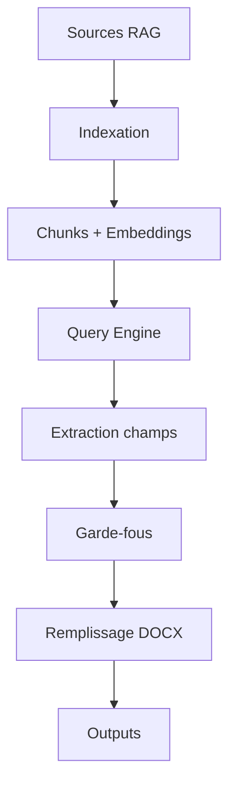

# Guide UI Training - RH-Pro

## Vue d'ensemble

L'UI Training permet de :
1. **Scanner** un BATCH de clients
2. **Analyser** la compatibilité pipeline de chaque client
3. **Normaliser** les clients en sandbox
4. **Générer** des comptes-rendus RH-Pro avec RAG + DOCX

## 1. UI "Training" - Mode Batch

### Workflow principal

```
1. Sélectionner BATCH_XX
   ↓
2. Scanner le batch → Table clients détectés
   ↓
3. Sélectionner client(s) dans la table
   ↓
4. Actions : Analyser / Normaliser / Run (RAG+DOCX)
```

### Table "Clients Détectés"

Colonnes affichées :
- **Sélection** : Checkbox pour sélectionner le client
- **Nom dossier** : Nom du dossier client
- **Compatibilité** : ✅/⚠️ + score (0.0 à 1.0)
- **GOLD** : ✅ détecté / ❌ non détecté
- **Sources RAG** : Nombre + types (.docx:3, .pdf:2, etc.)
- **Warnings** : Nombre d'avertissements

### Boutons d'action

#### 🔍 Analyser
Affiche la vue "Analyse client" détaillée avec :
- **Ce que j'ai trouvé** : GOLD, sources RAG, dossiers
- **Ce que je peux exploiter** : Éléments utilisables pour la pipeline
- **Ce qui manque** : Pour être 100% pipeline-ready
- **GOLD choisi** : Justification du choix
- *(optionnel)* Aperçu 10 lignes de chunks RAG (debug)

#### 🔧 Normaliser
Normalise les clients sélectionnés en sandbox :
```
sandbox/BATCH_NAME/client_slug/
  ├── sources/         ← Copies des sources RAG
  ├── gold/           ← Copie du GOLD
  ├── normalized/     ← Alias source.docx (optionnel)
  └── meta.json       ← Métadonnées
```

#### 🚀 Run (RAG+DOCX)
Lance la génération complète :
1. Construire index RAG depuis `sources/`
2. Extraire champs via RAG avec garde-fous
3. Remplir template DOCX
4. Générer outputs

## 2. Vue "Analyse Client"

### Sections affichées

#### ✅ Ce que j'ai trouvé
- **GOLD** : Fichier, score, stratégie de détection
- **Sources RAG** : Liste des fichiers exploitables
- **Dossiers** : Structure détectée

#### 🎯 Ce que je peux exploiter
- GOLD exploitable : Oui/Non (basé sur score >= 0.3)
- Sources RAG exploitables : Nombre de fichiers valides
- Dossiers exploitables : Dossiers contenant des sources

#### ⚠️ Ce qui manque pour être 100% pipeline
Liste des éléments manquants :
- Document GOLD introuvable
- Confiance GOLD faible
- Peu de sources RAG
- Dossiers manquants (01, 06)

#### 📄 GOLD choisi
- **Fichier** : Nom du fichier sélectionné
- **Score** : Score de confiance (0.0 à 1.0)
- **Raison** : Justification du choix

#### 🔍 Aperçu chunks RAG (optionnel, debug)
Affiche les 10 premiers chunks générés :
- ID du chunk
- Fichier source
- Texte (aperçu 500 chars)
- Longueur totale

## 3. Génération "Compte-Rendu RH-Pro"

### Pipeline de génération



### Garde-fous (mode strict)

**Règles strictes** :
- ✅ Utiliser UNIQUEMENT les informations des documents
- ❌ Si non trouvé → "Non renseigné"
- ❌ Ne JAMAIS inventer, déduire ou supposer
- ✅ Citer la source (document + page/snippet)

### Template DOCX

Template attendu : `TEMPLATE_V1_2_2.docx` (ou autre)

**Placeholders** :
```
{{nom}}
{{prenom}}
{{date_naissance}}
{{situation_professionnelle}}
{{objectifs_professionnels}}
...
```

Si pas de template fourni → Document simple généré automatiquement

### Outputs générés

#### 1. `generated.docx`
Compte-rendu RH-Pro rempli avec les données extraites

#### 2. `debug.json`
```json
{
  "timestamp": "2025-12-27T...",
  "gold_reference": "path/to/gold.docx",
  "index": {
    "sources_count": 12,
    "chunks_created": 156,
    "chunks_preview": [...]
  },
  "fields": {
    "nom": {
      "value": "Dupont",
      "citations": [...],
      "sources_used": ["doc1.docx", "doc2.pdf"],
      "confidence": 0.87
    },
    "prenom": {
      "value": "Jean",
      "citations": [...],
      "confidence": 0.92
    },
    ...
  },
  "warnings": [...]
}
```

**Contenu** :
- Preuves de chaque champ
- Citations internes (doc + snippet)
- Confiance par champ
- Warnings

#### 3. `metrics.json`
```json
{
  "timestamp": "2025-12-27T...",
  "required_coverage": 85.5,
  "weighted_coverage": 72.3,
  "quality_score": 0.78,
  "avg_confidence": 0.81,
  "total_fields": 20,
  "filled_fields": 16,
  "required_fields": 5,
  "required_filled": 4
}
```

**Métriques** :
- `required_coverage` : Couverture des champs obligatoires (%)
- `weighted_coverage` : Couverture globale (%)
- `quality_score` : Score de qualité (0.0 à 1.0)
- `avg_confidence` : Confiance moyenne

## 4. Utilisation

### Via Streamlit

```bash
streamlit run streamlit_app.py
```

Puis naviguer vers : **🎓 Entraînement Pipeline RH-Pro**

### Via démo Python

```bash
python demo_training_ui.py
```

Menu interactif :
1. Scanner un batch
2. Analyser un client
3. Générer un compte-rendu
4. Quitter

### Via code Python

```python
from src.rhpro.batch_analyzer import scan_batch_clients
from src.rhpro.report_generator import generate_report_from_normalized

# Scanner un batch
result = scan_batch_clients("data/samples/BATCH_20")

# Générer un rapport
output = generate_report_from_normalized(
    normalized_folder="sandbox/BATCH_20/client_01",
    output_dir="output",
    strict_mode=True,
)
```

## 5. Architecture des modules

```
src/rhpro/
├── client_scanner.py       # Scan d'un client individuel
├── batch_analyzer.py       # Scan d'un batch complet
├── rag_generator.py        # Index RAG + extraction
├── report_generator.py     # Génération DOCX + outputs
└── client_normalizer.py    # Normalisation en sandbox

pages_streamlit/
└── training.py             # UI Streamlit Training

demo_training_ui.py         # Démo CLI
```

## 6. Prochaines étapes

- [ ] Support templates DOCX avancés (styles, images)
- [ ] Amélioration détection GOLD (ML scoring)
- [ ] Cache RAG index (éviter rebuild)
- [ ] Comparaison GOLD vs generated (diff)
- [ ] Export CSV des métriques batch
- [ ] Visualisations (charts, graphs)

## 7. Dépendances

```bash
# Core
streamlit
pandas

# RAG
llama-index
llama-index-embeddings-openai
llama-index-llms-openai

# DOCX
python-docx

# NLP (optionnel)
sentence-transformers
```

Installation :
```bash
pip install -r requirements.txt
```
